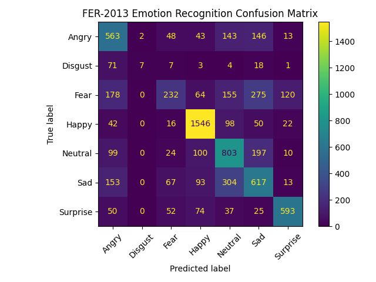

# Real-Time Facial Emotion Recognition Using CNN

A real-time facial emotion recognition system built using Python, TensorFlow/Keras, OpenCV, and a Convolutional Neural Network (CNN). The system detects faces from a live webcam feed and classifies facial expressions into seven emotion categories.

## Project Overview

This project uses the FER-2013 facial expression dataset to train a CNN model for facial emotion classification.

The system recognizes the following seven emotions:

- Angry
- Disgust
- Fear
- Happy
- Neutral
- Sad
- Surprise

After training, OpenCV is used to detect faces from a live webcam stream. Each detected face is converted to grayscale, resized to 48×48 pixels, normalized, and passed to the trained CNN model for emotion prediction.

## Problem Statement

Recognizing human emotions from facial expressions manually can be subjective and difficult to automate in real-time applications.

This project addresses the problem by developing a computer vision and deep learning system that automatically detects facial expressions and predicts the corresponding emotion from live webcam input.

## System Architecture

```text
                    FER-2013 Dataset
                           |
                           v
                  Image Preprocessing
                           |
                           v
                    Data Augmentation
                           |
                           v
                    CNN Model Training
                           |
                           v
                    Trained CNN Model
                           |
                           v
                       Webcam
                           |
                           v
                    Face Detection
                  (OpenCV Haar Cascade)
                           |
                           v
                   Grayscale 48×48
                           |
                           v
                    CNN Prediction
                           |
                           v
              Emotion + Confidence Score
```

## Technologies Used

| Technology | Purpose |
|------------|---------|
| Python 3.10.11 | Programming language |
| TensorFlow 2.15.0 | Deep learning framework |
| Keras | CNN model development |
| OpenCV 4.11.0 | Face detection and webcam processing |
| NumPy | Numerical and image processing |
| Matplotlib | Confusion matrix visualization |
| Scikit-learn | Model evaluation and classification report |
| FER-2013 | Facial emotion dataset |
| VS Code | Development environment |

## CNN Architecture

The project uses a custom Convolutional Neural Network designed for 48×48 grayscale facial images.

```text
Input: 48 × 48 × 1
        |
        v
Conv2D - 64 filters
        |
Batch Normalization
        |
Max Pooling
        |
Dropout
        |
Conv2D - 128 filters
        |
Batch Normalization
        |
Max Pooling
        |
Dropout
        |
Conv2D - 256 filters
        |
Batch Normalization
        |
Max Pooling
        |
Dropout
        |
Flatten
        |
Dense - 512 neurons
        |
Dropout
        |
Dense - 7 neurons
        |
Softmax
```

The final Softmax layer produces probabilities for the seven emotion classes.

## Dataset

The project uses the FER-2013 facial expression dataset.

The dataset is organized into training and testing directories:

```text
Data/
└── fer2013/
    ├── train/
    │   ├── Angry/
    │   ├── Disgust/
    │   ├── Fear/
    │   ├── Happy/
    │   ├── Neutral/
    │   ├── Sad/
    │   └── Surprise/
    │
    └── test/
        ├── Angry/
        ├── Disgust/
        ├── Fear/
        ├── Happy/
        ├── Neutral/
        ├── Sad/
        └── Surprise/
```

The images are converted to grayscale and resized to 48×48 pixels before being supplied to the CNN.

## Data Preprocessing

The images are normalized by scaling pixel values from:

```text
0 - 255
```

to:

```text
0 - 1
```

Training data augmentation is applied using:

- Rotation
- Width shifting
- Height shifting
- Zoom
- Horizontal flipping

These transformations help the model learn from variations in image orientation and facial positioning.

## Model Training

The CNN is trained using:

- Adam optimizer
- Categorical cross-entropy loss
- Accuracy metric
- Batch size: 64
- Maximum epochs: 40
- Early stopping
- Best-model checkpointing

The model contains approximately 2.47 million parameters.

The best performing model is saved as:

```text
checkpoints/best_model.keras
```

The final trained model is saved as:

```text
checkpoints/final_model.keras
```

## Model Performance

The trained CNN model was evaluated on the FER-2013 test dataset.

The model achieved:

- Test Accuracy: **60.76%**
- Test Samples: **7,178**
- Correct Predictions: **4,361**

The model performs relatively well on expressions such as Happy, Neutral, and Surprise, while Fear and Disgust are more challenging classes.

The confusion matrix below provides a detailed view of correct and incorrect predictions across all seven emotion classes.

### Confusion Matrix



The model performs relatively well on expressions such as Happy, Neutral, and Surprise, while Fear and Disgust are more challenging classes.

A confusion matrix is generated during evaluation to analyze the classification performance across all seven emotions.

## Model Evaluation

The trained model is evaluated using:

- Test accuracy
- Classification report
- Confusion matrix

The confusion matrix provides a detailed view of correct and incorrect predictions for each emotion class.

The generated confusion matrix is saved as:

```text
checkpoints/confusion_matrix.png
```

## Real-Time Emotion Recognition

The real-time application follows this pipeline:

```text
Webcam Frame
     |
     v
Convert to Grayscale
     |
     v
Detect Face using Haar Cascade
     |
     v
Extract Face Region
     |
     v
Resize to 48 × 48
     |
     v
Normalize Pixel Values
     |
     v
CNN Prediction
     |
     v
Display Emotion + Confidence
```

The application detects faces from the webcam and displays the predicted emotion and confidence percentage above each detected face.

Press:

```text
Q
```

to stop the webcam application.

## Project Structure

```text
Emotion_recognition/
│
├── Data/
│   └── fer2013/
│       ├── train/
│       └── test/
│
├── src/
│   ├── __init__.py
│   ├── model.py
│   ├── train.py
│   ├── evaluate.py
│   └── infer_realtime.py
│
├── checkpoints/
│   └── confusion_matrix.png
│
├── requirements.txt
├── README.md
├── .gitignore
└── .venv/
```

## Installation

### 1. Create the Virtual Environment

Using Python 3.10:

```powershell
py -3.10 -m venv .venv
```

### 2. Activate the Virtual Environment

For Windows PowerShell:

```powershell
.\.venv\Scripts\Activate.ps1
```

### 3. Install Dependencies

```powershell
pip install -r requirements.txt
```

## Train the Model

From the project root directory, run:

```powershell
python -m src.train
```

The training process loads the FER-2013 dataset, trains the CNN, and saves the best and final models inside the `checkpoints` directory.

## Evaluate the Model

Run:

```powershell
python -m src.evaluate
```

This generates:

- Test accuracy
- Classification report
- Confusion matrix

The confusion matrix is saved as:

```text
checkpoints/confusion_matrix.png
```

## Run Real-Time Emotion Recognition

Start the webcam application using:

```powershell
python -m src.infer_realtime
```

The application will:

1. Open the webcam.
2. Detect faces.
3. Extract each face.
4. Convert the face to grayscale.
5. Resize it to 48×48 pixels.
6. Normalize the image.
7. Predict the emotion using the trained CNN.
8. Display the emotion and confidence percentage.

Press `Q` to exit.

## Key Features

- CNN-based facial emotion classification
- FER-2013 dataset integration
- Seven emotion classes
- OpenCV Haar Cascade face detection
- Real-time webcam inference
- Confidence score display
- Data augmentation during training
- Model checkpointing
- Classification report generation
- Confusion matrix visualization

## Limitations

The system has several practical limitations:

- FER-2013 contains noisy and challenging facial images.
- Some facial expressions are visually similar and difficult to distinguish.
- Lighting conditions can affect webcam predictions.
- Face angle and partial occlusion can reduce accuracy.
- Real-world webcam performance can differ from dataset evaluation results.
- The model only recognizes seven predefined emotion categories.
- The Disgust class has fewer training examples compared with some other classes.

## Future Improvements

Possible improvements include:

- Using deeper CNN architectures
- Applying transfer learning with suitable pretrained models
- Improving class balancing
- Using larger and more diverse facial expression datasets
- Improving face alignment and preprocessing
- Adding temporal analysis for video-based emotion recognition
- Deploying the model as a web or mobile application
- Optimizing the model for edge devices
- Exploring multimodal emotion recognition using facial expressions, speech, and text

## Conclusion

This project demonstrates an end-to-end deep learning and computer vision pipeline for real-time facial emotion recognition.

A CNN was trained using the FER-2013 dataset to classify seven facial emotions. OpenCV was then integrated to detect faces from a live webcam stream and provide real-time emotion predictions with confidence scores.

The project provides practical experience in:

- Dataset preprocessing
- Data augmentation
- CNN development
- Deep learning model training
- Model evaluation
- Computer vision
- Face detection
- Real-time inference
- Python environment management

## Author

**Shashank TJ**